## 1. TOP 5 Autores con más libros en la colección

### Objetivo
Encontrar los 5 autores que tienen la mayor cantidad de libros registrados en la biblioteca.

### Consulta SQL
```sql
SELECT 
    a.id,
    CONCAT(a.nombre, ' ', a.apellido) AS autor,
    COUNT(l.id) AS cantidad_libros
FROM autor a
JOIN libro l ON a.id = l.autor_id
GROUP BY a.id, a.nombre, a.apellido
ORDER BY cantidad_libros DESC
OFFSET 0 ROWS FETCH NEXT 5 ROWS ONLY;
```

### Explicación Paso a Paso

**1. FROM y JOIN**: Combinamos las tablas `autor` y `libro`

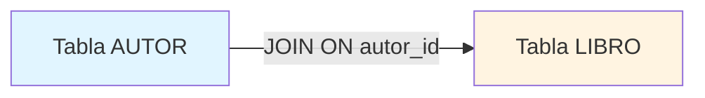

**2. Relación entre tablas:**

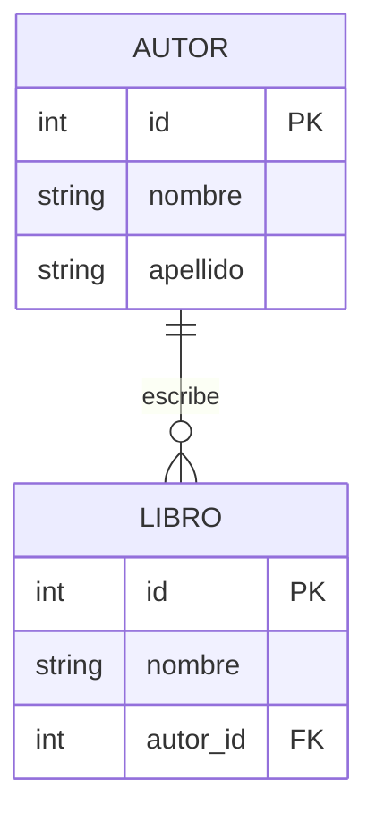

**3. Proceso de la consulta:**

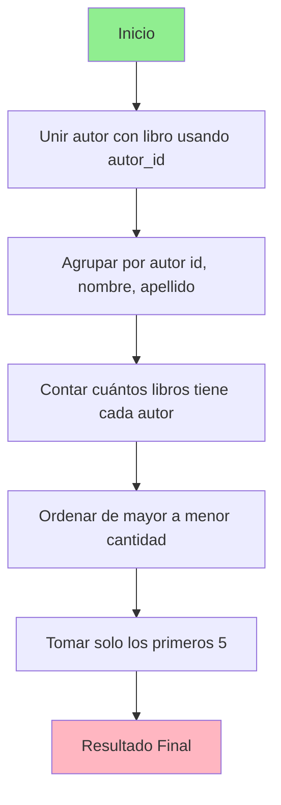

### Visualización del resultado

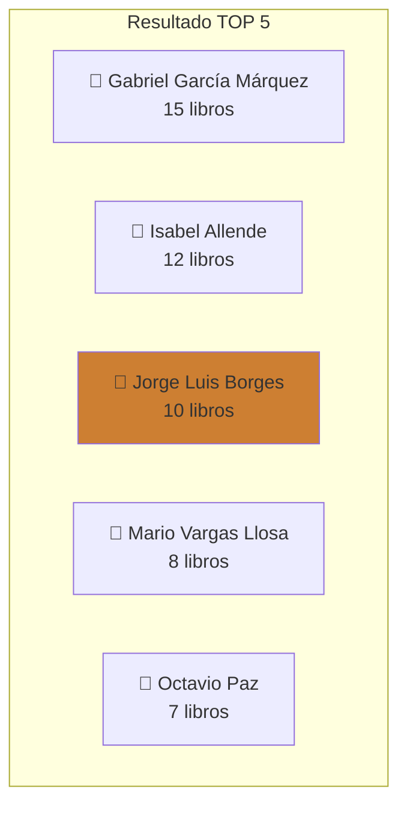

### Conceptos clave:
- **JOIN**: Une dos tablas relacionadas
- **GROUP BY**: Agrupa registros con características comunes
- **COUNT()**: Cuenta cuántos registros hay en cada grupo
- **ORDER BY DESC**: Ordena de mayor a menor
- **FETCH NEXT 5**: Limita el resultado a 5 registros

---

## 2. TOP 5 Editoriales más populares

### Objetivo
Identificar las editoriales que han publicado más libros en nuestra colección.

### Consulta SQL
```sql
SELECT 
    e.id,
    e.nombre AS editorial,
    COUNT(l.id) AS cantidad_libros
FROM editorial e
JOIN libro l ON e.id = l.editorial_id
GROUP BY e.id, e.nombre
ORDER BY cantidad_libros DESC
OFFSET 0 ROWS FETCH NEXT 5 ROWS ONLY;
```

### Diagrama de Relación

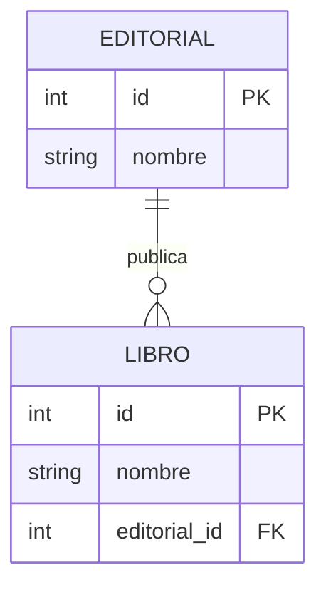

### Proceso Visual

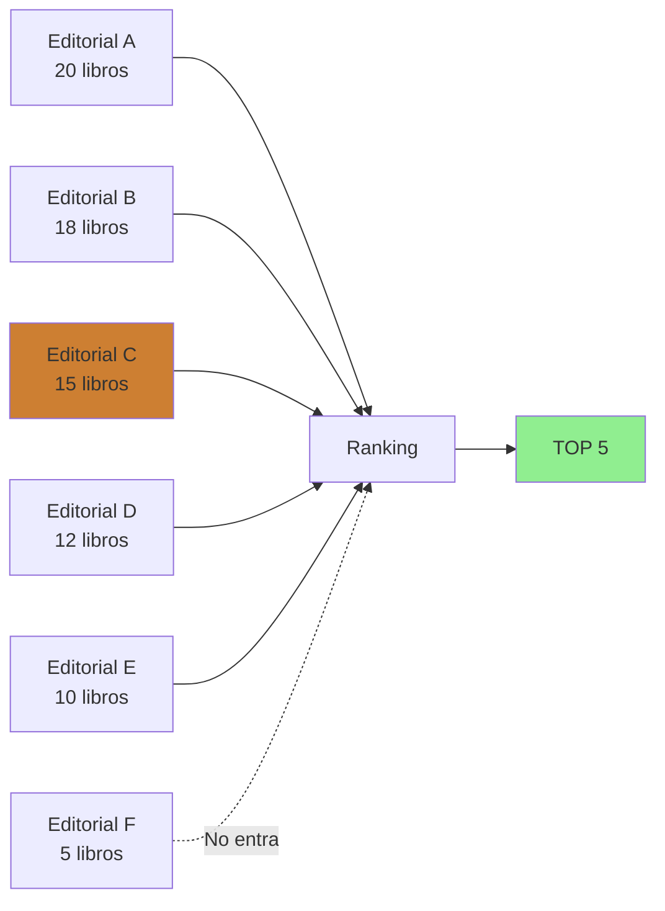

### Ejemplo de Agrupación

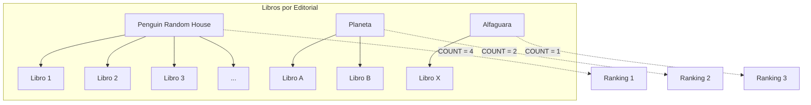

---

## 3. Libros actualmente prestados (no devueltos)

### Objetivo
Mostrar todos los libros que están prestados y aún no han sido devueltos.

### Consulta SQL
```sql
SELECT 
    p.id AS id_prestamo,
    l.nombre AS libro,
    CONCAT(u.nombre, ' ', u.apellido) AS usuario,
    p.fecha_prestamo
FROM prestamo p
JOIN libro l ON p.libro_id = l.id
JOIN usuario u ON p.usuario_id = u.id
LEFT JOIN devolucion d ON d.prestamo_id = p.id
WHERE d.id IS NULL;
```

### Diagrama de Relaciones

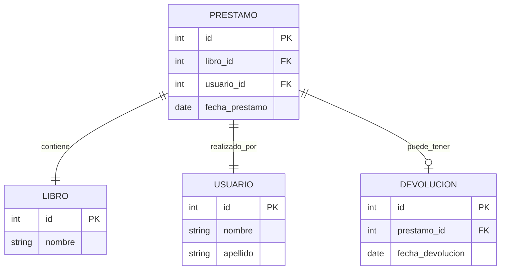

### Flujo de la Consulta
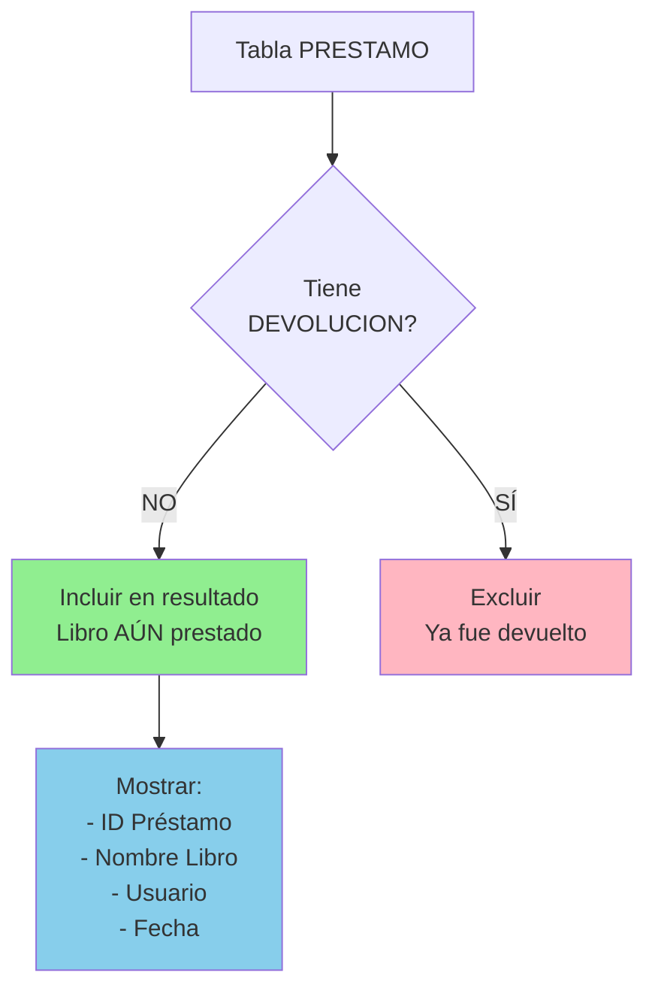

### Visualización de LEFT JOIN

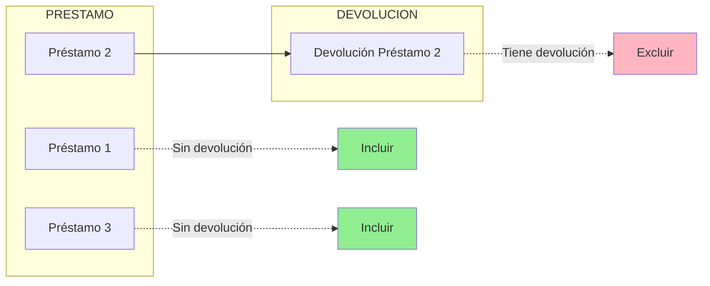

### Concepto Clave: LEFT JOIN + WHERE NULL

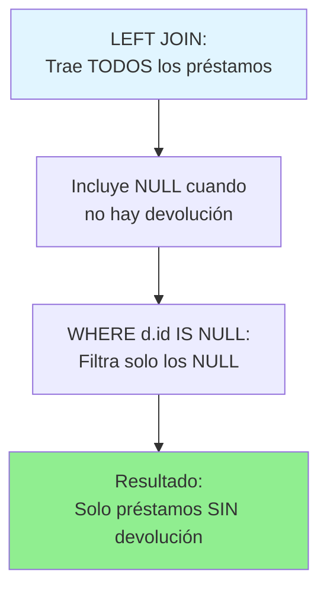

---

## 4. Usuarios que deben a la biblioteca

### 🎯 Objetivo
Identificar usuarios con multas pendientes de pago.

### Consulta SQL
```sql
SELECT 
    DISTINCT u.id,
    CONCAT(u.nombre, ' ', u.apellido) AS usuario,
    COUNT(m.id) AS cantidad_multas,
    SUM(m.monto) AS total_deuda
FROM multa m
JOIN devolucion d ON m.devolucion_id = d.id
JOIN prestamo p ON d.prestamo_id = p.id
JOIN usuario u ON p.usuario_id = u.id
GROUP BY u.id, u.nombre, u.apellido
HAVING SUM(m.monto) > 0
ORDER BY total_deuda DESC;
```

### Cadena de Relaciones

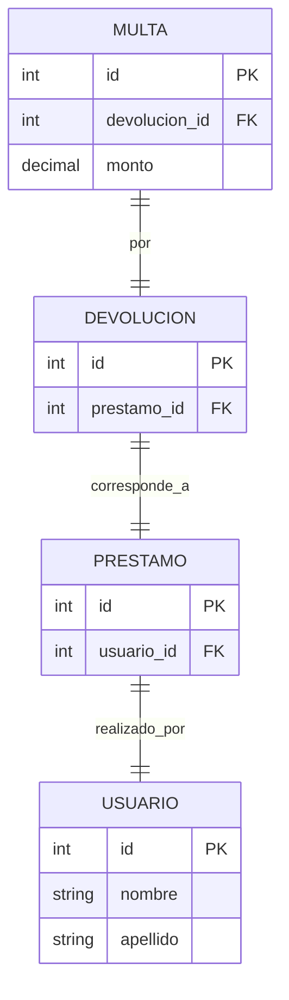

### Proceso de la Consulta

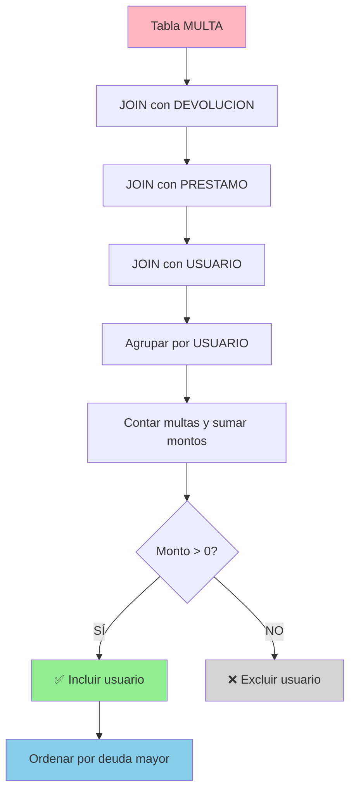

### 💰 Ejemplo Visual de Agregación

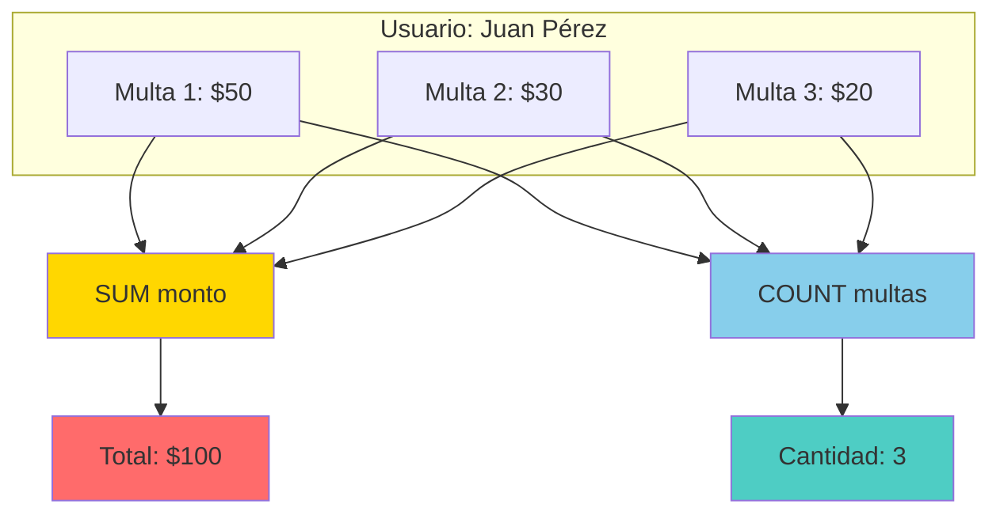

### Diferencia: WHERE vs HAVING

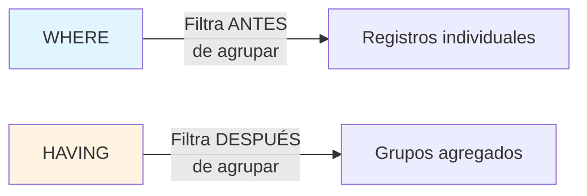

---

## 5. TOP 5 Usuarios con más multas

### Objetivo
Identificar los 5 usuarios que han acumulado más multas (no necesariamente el mayor monto).

### Consulta SQL
```sql
SELECT 
    TOP 5
    u.id,
    CONCAT(u.nombre, ' ', u.apellido) AS usuario,
    COUNT(m.id) AS cantidad_multas,
    SUM(m.monto) AS total_monto
FROM multa m
JOIN devolucion d ON m.devolucion_id = d.id
JOIN prestamo p ON d.prestamo_id = p.id
JOIN usuario u ON p.usuario_id = u.id
GROUP BY u.id, u.nombre, u.apellido
ORDER BY cantidad_multas DESC, total_monto DESC;
```

### Diferencia con la consulta anterior

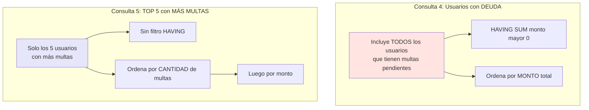

### 🏆 Ranking Visual

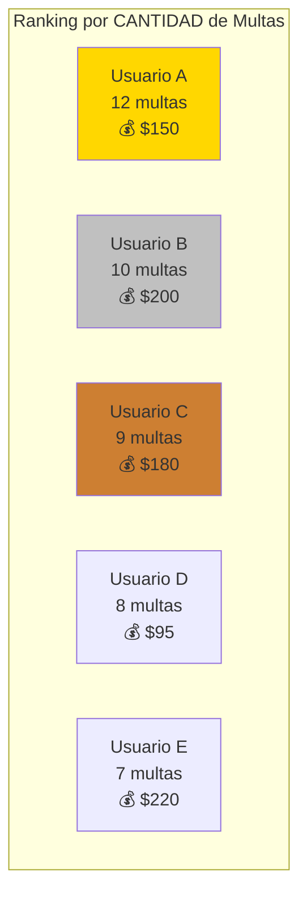

### Comparación de Ordenamiento

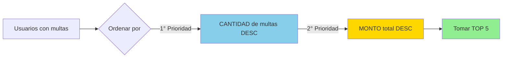

### Ejemplo de Ordenamiento Dual

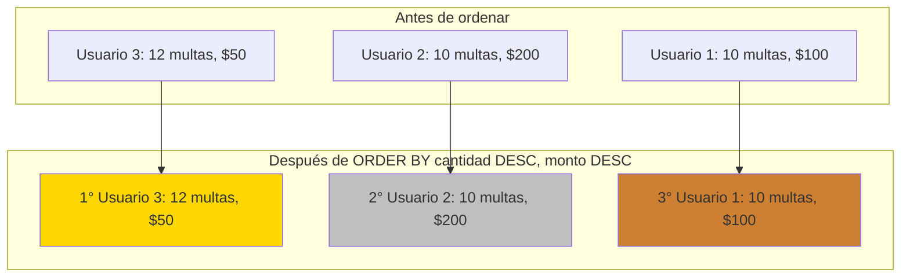

---

## Resumen de Conceptos SQL

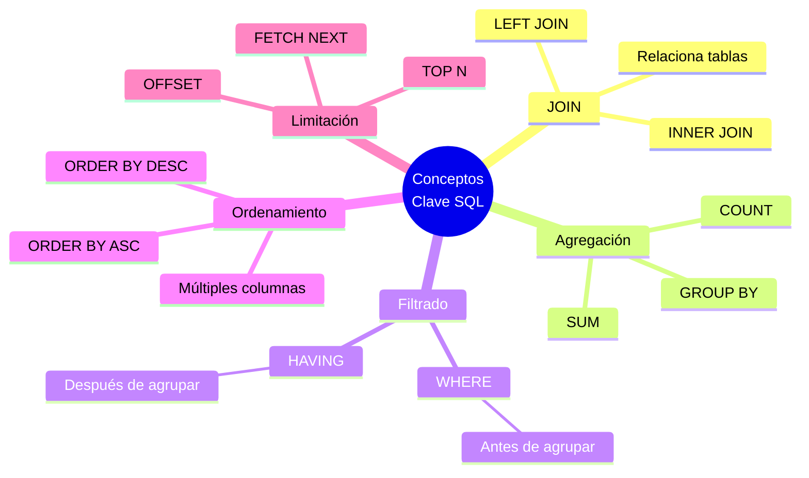

---

## Guía de Construcción de Consultas

```mermaid
flowchart TD
    START[Inicio] --> Q1{¿Qué datos<br/>necesito?}
    Q1 --> Q2[Identificar tablas necesarias]
    Q2 --> Q3{¿Necesito<br/>relacionar tablas?}
    Q3 -->|SÍ| Q4[Usar JOIN]
    Q3 -->|NO| Q5[FROM tabla]
    Q4 --> Q6{¿Necesito<br/>contar/sumar?}
    Q5 --> Q6
    Q6 -->|SÍ| Q7[Usar COUNT/SUM<br/>y GROUP BY]
    Q6 -->|NO| Q8[SELECT directo]
    Q7 --> Q9{¿Filtrar<br/>grupos?}
    Q9 -->|SÍ| Q10[Usar HAVING]
    Q9 -->|NO| Q11[Continuar]
    Q8 --> Q12{¿Filtrar<br/>registros?}
    Q10 --> Q11
    Q12 -->|SÍ| Q13[Usar WHERE]
    Q12 -->|NO| Q11
    Q13 --> Q11
    Q11 --> Q14{¿Ordenar?}
    Q14 -->|SÍ| Q15[ORDER BY]
    Q14 -->|NO| Q16[Fin]
    Q15 --> Q17{¿Limitar<br/>resultados?}
    Q17 -->|SÍ| Q18[TOP o FETCH]
    Q17 -->|NO| Q16
    Q18 --> Q16
    
    style START fill:#90EE90
    style Q16 fill:#FFB6C1
    style Q7 fill:#FFD700
    style Q10 fill:#87CEEB
```
